# Создание cloud-инфраструктуры: VPS и S3

В этом разделе описана подготовка cloud-инфраструктуры для релизного стенда **IoT Data Platform**.

Цель этапа:

- создать S3 bucket для хранения Iceberg warehouse;
- создать сервисные аккаунты для доступа к Object Storage;
- выдать сервисным аккаунтам необходимые роли;
- создать VPS для запуска платформы через Docker Compose.

Релизный стенд использует следующую схему:

```text
SOURCE → STREAM → ICEBERG → S3
```

S3 используется как объектное хранилище для Iceberg-таблиц, а VPS используется для запуска контейнеров платформы.

---

## 1. Создание сервисного аккаунта для записи в S3

Переходим в раздел **Identity and Access Management → Сервисные аккаунты**.

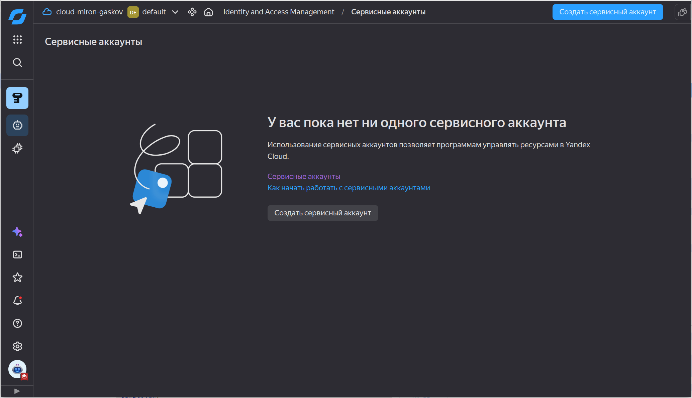

Создаём сервисные аккаунты для записи и чтения данных в S3.

`s3-editor` будет использоваться для записи Iceberg-файлов в Object Storage, а `s3-viewer` для просмотра данных.

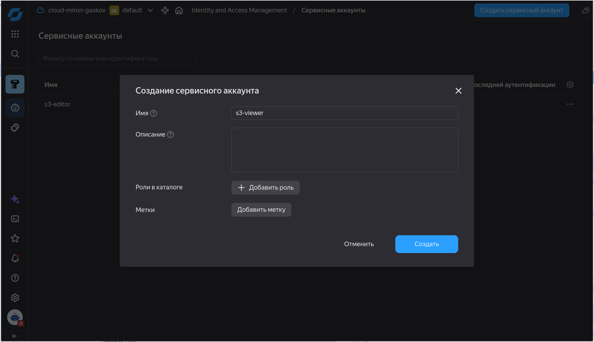

После создания аккаунта переходим в него и создаём статический ключ доступа.

Статический ключ нужен для доступа к Object Storage через S3-compatible API.

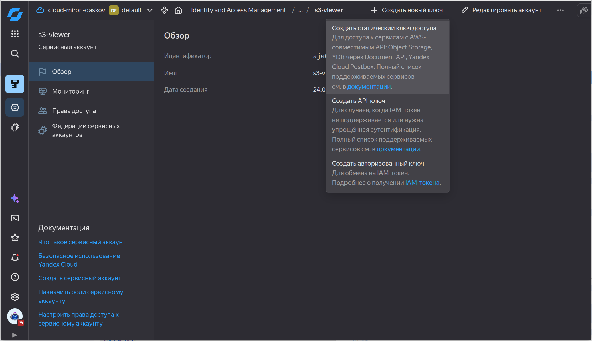

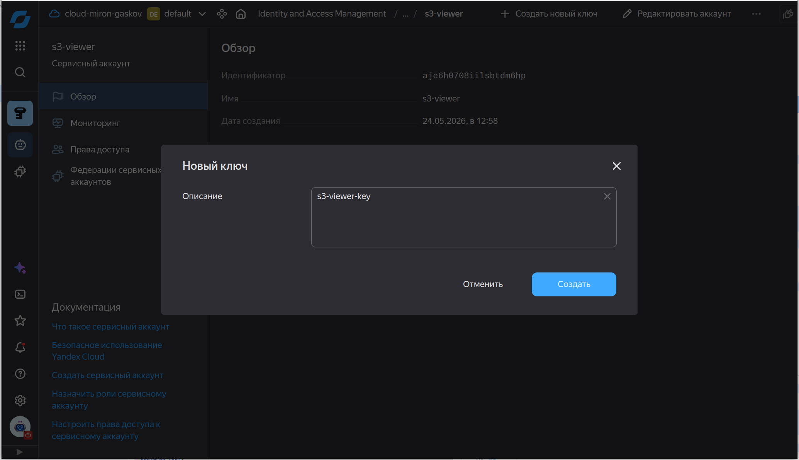

После создания ключа необходимо сохранить:

- Access Key ID;
- Secret Access Key.

Эти значения будут использоваться в `.env` файле релизного стенда.

> Важно: реальные ключи нельзя коммитить в Git. В репозитории должен храниться только `.env.example`.

Назначение аккаунтов:

| Сервисный аккаунт | Назначение |
|---|---|
| `s3-editor` | Запись данных релизным стендом |
| `s3-viewer` | Read-only доступ для аналитиков или проверки чтения |

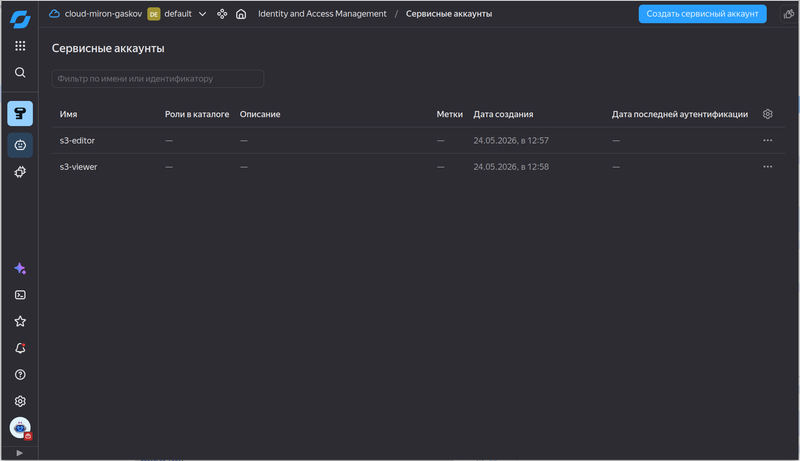

## 2. Создание S3 bucket

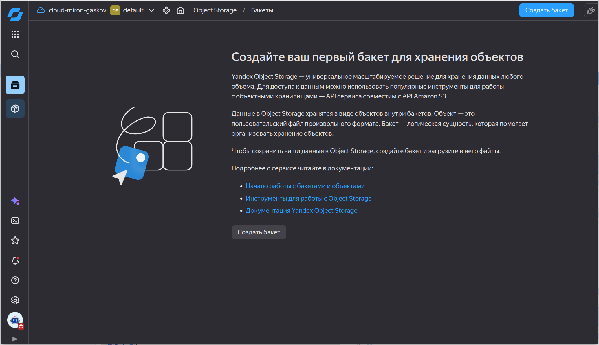


Для релизного стенда важно, чтобы bucket не был публичным.

В настройках доступа должно быть выбрано:

```text
С авторизацией
```

для:
- чтения объектов;
- чтения списка объектов;
- чтения настроек.

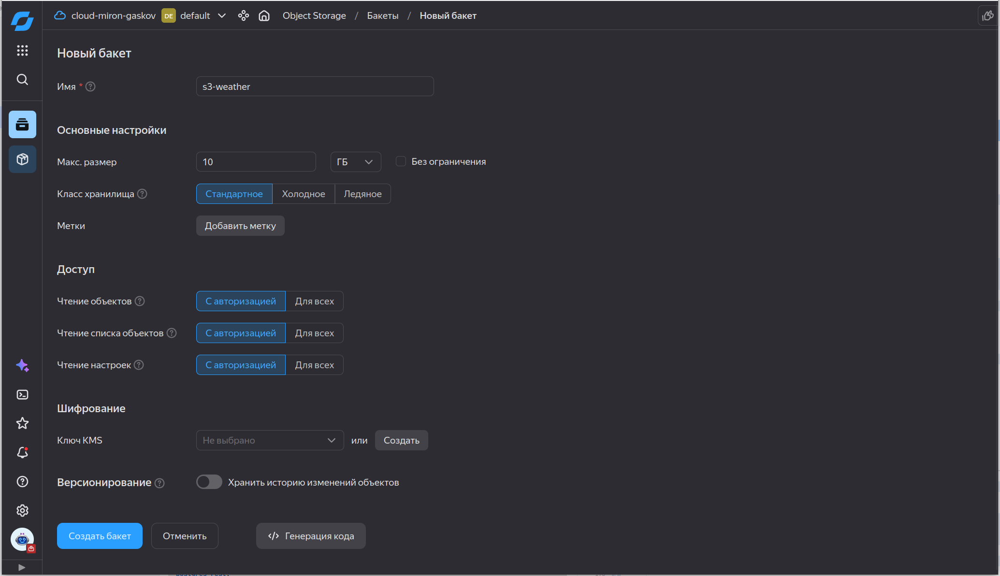

После создания bucket переходим в раздел **Безопасность → Права доступа**.

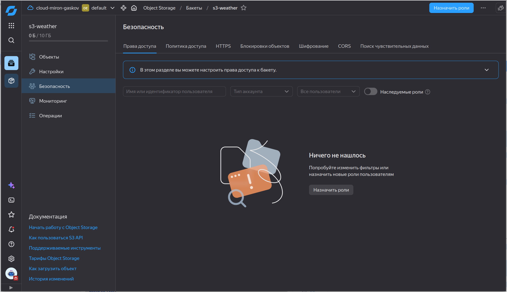


Для сервисного аккаунта `s3-editor` выдаём роль:

```text
storage.editor
```

Эта роль нужна релизному стенду, чтобы записывать Iceberg data files и metadata files в S3 bucket.


Для сервисного аккаунта `s3-viewer` выдаём роль:

```text
storage.viewer
```

Эта роль нужна для доступа только на чтение.


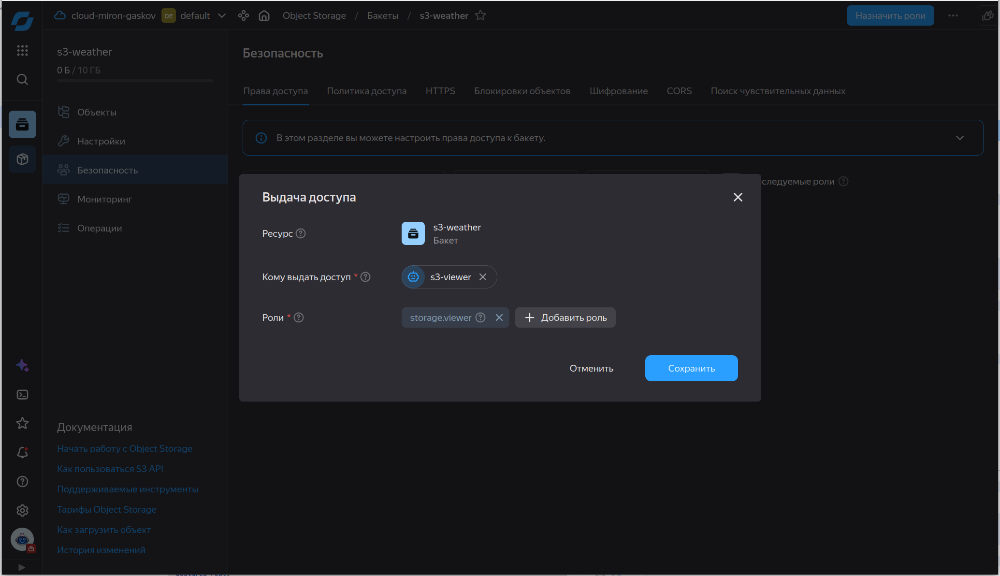

---

## 3. Создание VPS

Переходим в раздел **Compute Cloud → Виртуальные машины**.

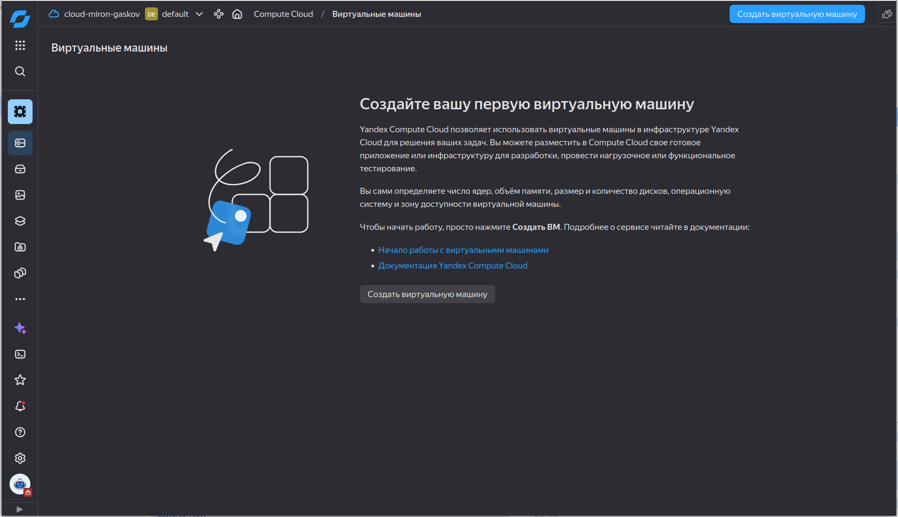

Создаём новую виртуальную машину.

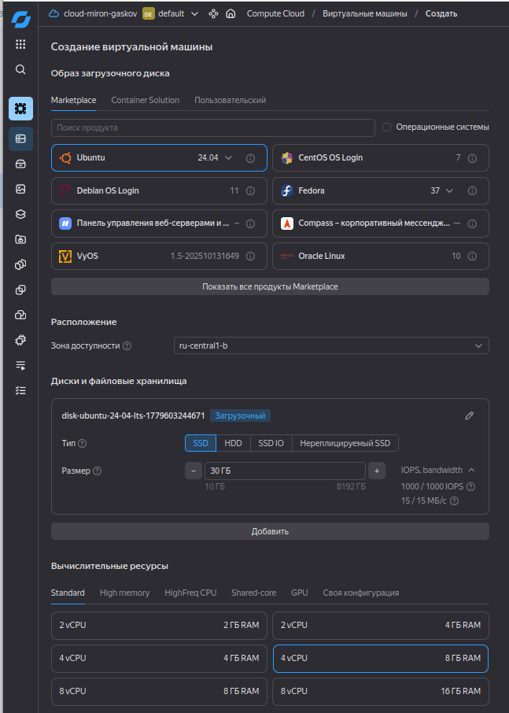

Для подключения к VPS добавляем SSH-ключ.

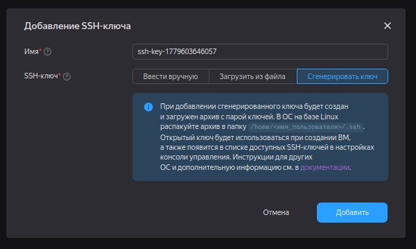
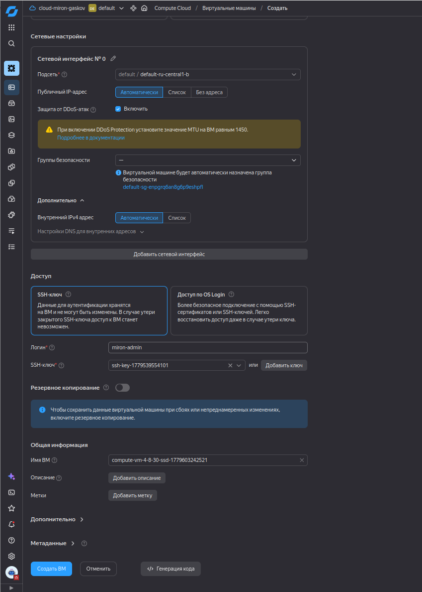
