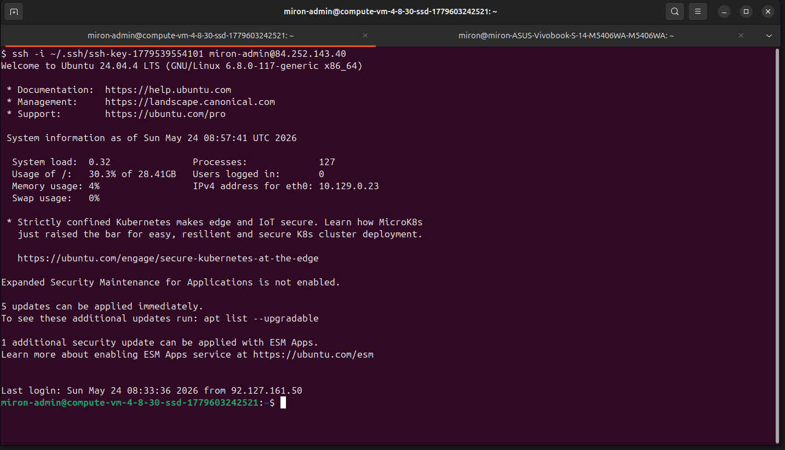
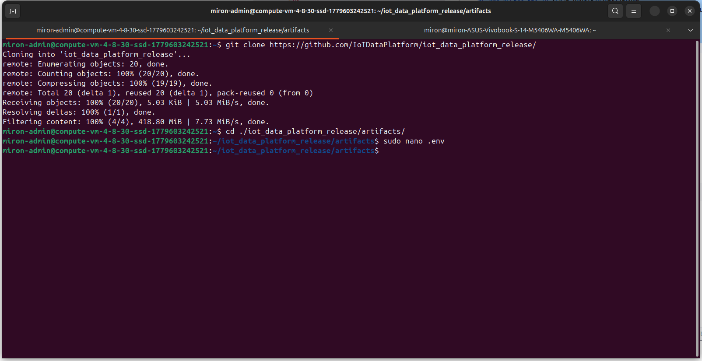
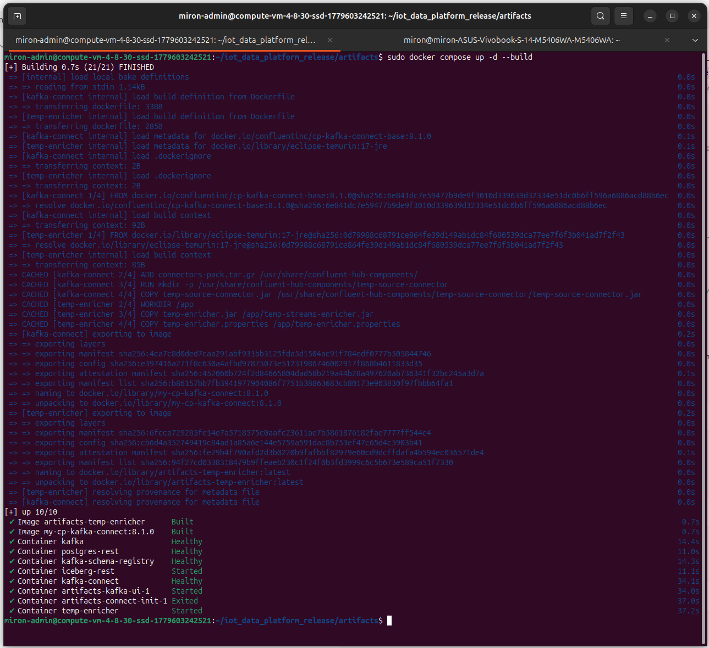

# Подключение к VPS и запуск deployment

В этом разделе описан запуск релизного стенда **IoT Data Platform** на подготовленной VPS.

На предыдущем этапе были созданы:

- VPS с Ubuntu;
- S3 bucket для Iceberg warehouse;
- сервисный аккаунт с доступом на запись в S3;
- статический S3 access key;

Релизный стенд запускается из директории:

```text
artifacts/
```

---

## 1. Подключение к VPS по SSH

Подключаемся к VPS по SSH с локальной машины.

```text
ssh -i ~/.ssh/<private-key> <user>@<VPS_PUBLIC_IP>
```



---

## 2. Установка Docker и Docker Compose

Для запуска релизного стенда на VPS нужен Docker Engine и Docker Compose plugin.

Обновляем список пакетов:

```text
sudo apt update
```

Устанавливаем Docker и Compose plugin:

```text
sudo apt install -y docker.io docker-compose-plugin
```

---

## 3. Установка Git LFS

В release-репозитории большие артефакты, например `*.jar` и `*.tar.gz`, хранятся через Git LFS. Поэтому перед клонированием нужно установить Git LFS.

Устанавливаем Git LFS:

```text
sudo apt install -y git-lfs
```

Инициализируем Git LFS:

```text
git lfs install
```

---

## 4. Клонирование release-репозитория

На VPS клонируем release-репозиторий:

```text
git clone https://github.com/IoTDataPlatform/iot_data_platform_release/
```

Переходим в директорию с deployable artifacts:

```text
cd iot_data_platform_release/artifacts/
```



---

## 5. Настройка `.env`

В директории `artifacts/` создаём `.env` на основе `.env.example`.

```text
cp .env.example .env
```

Открываем файл:

```text
nano .env
```

В `.env` указываются параметры S3/Iceberg и другие переменные окружения, необходимые для запуска стенда.

> Реальный `.env` не должен попадать в Git. В репозитории хранится только `.env.example`.

---

## 6. Запуск deployment

Запускаем контейнеры через Docker Compose:

```text
sudo docker compose up -d --build
```

Команда собирает локальные образы и запускает сервисы в фоне.



---

## 7. Доступ к Kafbat UI через SSH tunnel

Kafbat UI является административным интерфейсом и не должен быть доступен напрямую из интернета.

Доступ выполняется через SSH port forwarding с локальной машины:

```text
ssh -i ~/.ssh/<private-key> -L 8080:localhost:8080 <user>@<VPS_PUBLIC_IP>
```

После подключения UI открывается локально:

```text
http://localhost:8080
```
