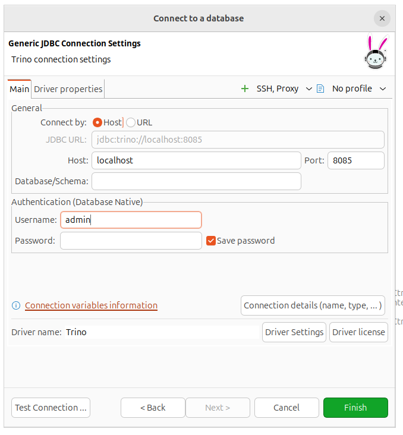
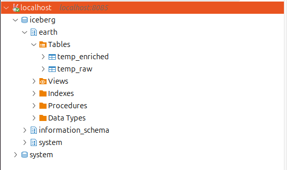
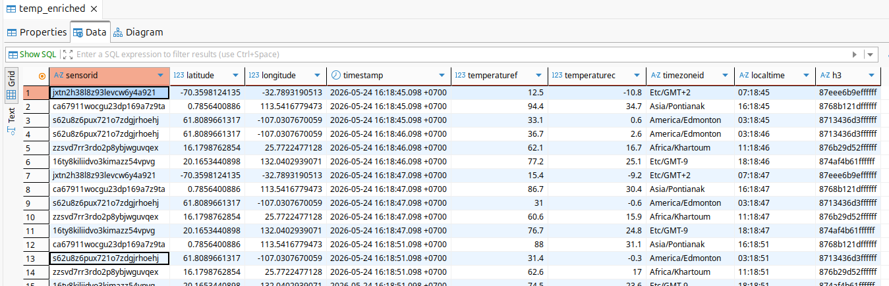
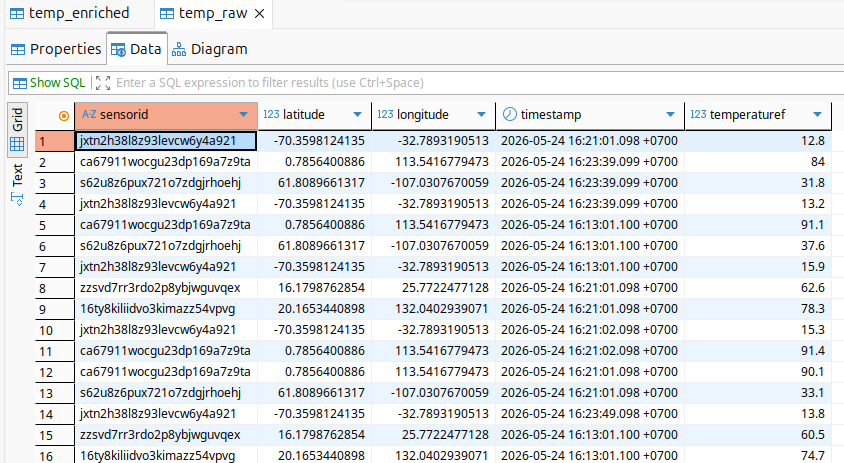

# Read-only доступ аналитика к данным Iceberg/S3

Для чтения данных используется отдельный S3 service account с ролью `storage.viewer`.

---

## 1. Подготовка read-only credentials

На предыдущем этапе был создан сервисный аккаунт:

```text
s3-viewer
```

Для него была выдана роль:

```text
storage.viewer
```

Этот аккаунт используется для чтения данных из S3 bucket без права записи.

В `.env` для локального Trino указываются read-only ключи:

```env
YC_AWS_ACCESS_KEY_ID=<s3-viewer-access-key>
YC_AWS_SECRET_ACCESS_KEY=<s3-viewer-secret-key>
YC_AWS_REGION=ru-central1
YC_S3_ENDPOINT=https://storage.yandexcloud.net
YC_S3_WAREHOUSE=s3://s3-weather/warehouse
```

> Важно: для аналитика нельзя использовать ключи `s3-editor`, потому что они дают права записи.

---

## 2. Конфигурация локального Trino

Для доступа используется локальный контейнер Trino.

Пример структуры:

```yaml
services:
  trino:
    image: trinodb/trino:480
    container_name: local-trino
    ports:
      - "8085:8080"
    env_file:
      - .env
    volumes:
      - ./catalog:/etc/trino/catalog:ro
    extra_hosts:
      - "host.docker.internal:host-gateway"
```

Каталог Iceberg настраивается через `catalog/iceberg.properties`.

В конфигурации используется:

- S3 endpoint;
- S3 region;
- S3 path-style access;
- read-only S3 credentials из `.env`.

Пример:

```properties
connector.name=iceberg

iceberg.catalog.type=rest
iceberg.rest-catalog.uri=http://host.docker.internal:8181
iceberg.rest-catalog.warehouse=${ENV:YC_S3_WAREHOUSE}

fs.native-s3.enabled=true
s3.endpoint=${ENV:YC_S3_ENDPOINT}
s3.region=${ENV:YC_AWS_REGION}
s3.path-style-access=true
s3.signer-type=AwsS3V4Signer
s3.aws-access-key=${ENV:YC_AWS_ACCESS_KEY_ID}
s3.aws-secret-key=${ENV:YC_AWS_SECRET_ACCESS_KEY}
```

---

## 3. Запуск Trino

Запускаем локальный Trino:

```text
docker compose up -d --build
```

---

## 4. Подключение аналитика через DBeaver

В DBeaver создаём подключение к Trino.

Параметры подключения:

| Поле | Значение |
|---|---|
| Host | `localhost` |
| Port | `8085` |
| Username | `admin` |
| Password | пустой |



После подключения в дереве баз данных должен появиться catalog:

```text
iceberg
```

Внутри schema:

```text
earth
```

И таблицы:

```text
temp_raw
temp_enriched
```



---

## 5. Проверка чтения таблиц

Можно посмотреть данные из таблицы temp_enriched



Можно посмотреть данные из таблицы temp_raw



---
