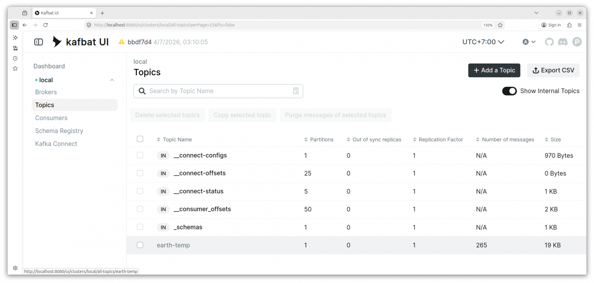
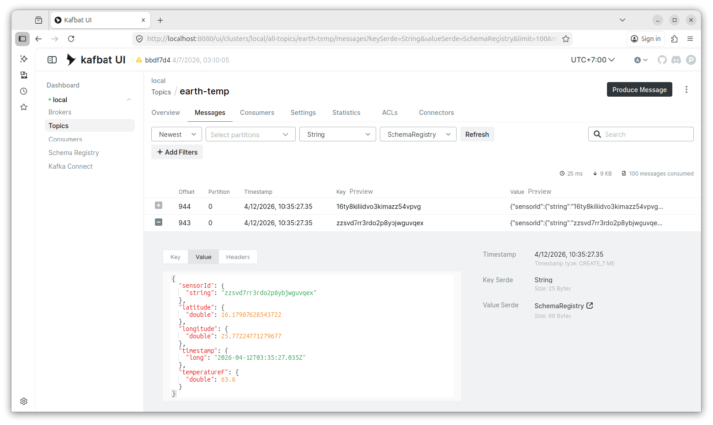
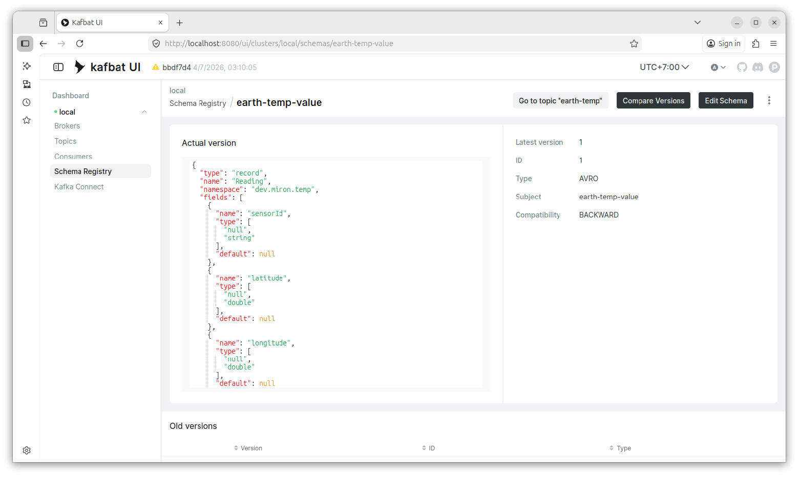
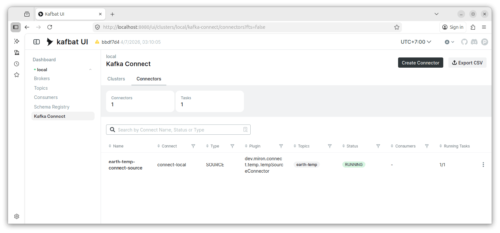
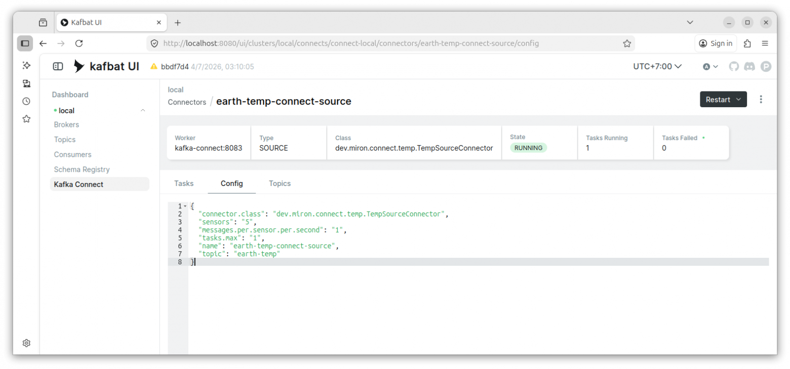
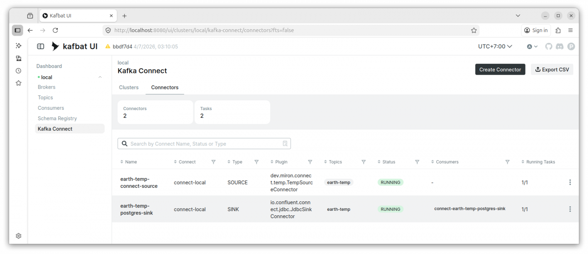
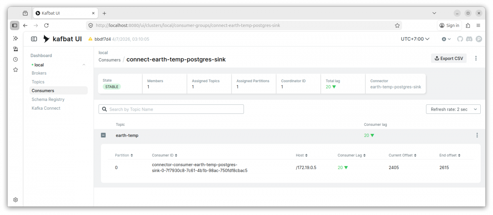

# Мониторинг релизного стенда

В этом разделе описана базовая инструкция для SRE/эксплуатации: как проверить, что релизный стенд **IoT Data Platform** работает после запуска.

Мониторинг выполняется через **Kafbat UI**. Это административный интерфейс, поэтому он не должен быть опубликован в интернет. Доступ выполняется только через SSH tunnel.

```text
ssh -i ~/.ssh/<private-key> -L 8080:localhost:8080 <user>@<VPS_PUBLIC_IP>
```

После подключения открыть в браузере:

```text
http://localhost:8080
```

---

## 1. Проверка Kafka topics

Открываем раздел **Topics**.

В списке должен быть topic:

```text
earth-temp
```

На скриншоте видно, что topic существует, имеет одну партицию и в него поступают сообщения.



Нормальное состояние:

| Проверка | Ожидаемый результат |
|---|---|
| Topic `earth-temp` | существует |
| Количество сообщений | растёт |

Если topic отсутствует, нужно проверить source connector и логи Kafka Connect.

---

## 2. Проверка сообщений в topic

Открываем topic `earth-temp`, вкладка **Messages**.

На скриншоте видно, что в topic появляются сообщения с температурными данными.



Нормальное состояние:

| Проверка | Ожидаемый результат            |
|---|--------------------------------|
| Новые сообщения | появляются                     |
| Key | заполнен                             |
| Value | читается через Schema Registry |
| В сообщении | есть `sensorId`, координаты, timestamp и температура                             |

Если сообщения не появляются, нужно проверить:

```text
sudo docker compose logs kafka-connect
```

и статус source connector.

---

## 3. Проверка Schema Registry

Открываем раздел **Schema Registry** и subject:

```text
earth-temp-value
```

На скриншоте видно, что схема зарегистрирована и имеет тип `AVRO`.



Нормальное состояние:

| Проверка | Ожидаемый результат |
|---|---|
| Subject `earth-temp-value` | существует |
| Type | `AVRO` |
| Compatibility | `BACKWARD` |
| Схема | содержит поля source-события |

Если схема отсутствует, Kafka Connect source может не публиковать данные или неправильно настроен converter.

---

## 4. Проверка Kafka Connect source connector

Открываем раздел **Kafka Connect → Connectors**.

На скриншоте видно, что source connector работает:

```text
earth-temp-connect-source
```



Нормальное состояние:

| Проверка | Ожидаемый результат |
|---|---|
| Connector `earth-temp-connect-source` существует | Да |
| Type | `SOURCE` |
| Status | `RUNNING` |
| Running tasks | `1/1` |
| Tasks failed | `0` |

Если статус не `RUNNING`, нужно открыть connector и посмотреть ошибки task.

---

## 5. Проверка конфигурации source connector

Открываем connector `earth-temp-connect-source`, вкладка **Config**.



---

## 6. Проверка source и sink connectors

После полного запуска стенда в Kafka Connect должны работать два connector:

- source connector;
- sink connector.

На скриншоте видно, что оба connector находятся в состоянии `RUNNING`.



Ожидаемое состояние:

| Connector | Type | Status | Running tasks |
|---|---|---|---|
| `earth-temp-connect-source` | `SOURCE` | `RUNNING` | `1/1` |
| `earth-temp-postgres-sink` / sink connector | `SINK` | `RUNNING` | `1/1` |

Если source работает, а sink нет, данные будут появляться в Kafka, но не будут попадать в целевое хранилище.

---

## 7. Проверка consumer group sink connector

Для sink connector проверяем consumer group.

На скриншоте показана consumer group:

```text
connect-earth-temp-postgres-sink
```



Важный показатель:

```text
Consumer Lag
```

Нормальное состояние:

| Проверка | Ожидаемый результат |
|---|---|
| Consumer group существует | Да |
| State | `STABLE` |
| Consumer lag | Небольшой или уменьшается |
| End offset растёт | Да |

Если lag постоянно растёт, значит sink не успевает обрабатывать сообщения или возникли ошибки записи.

---
