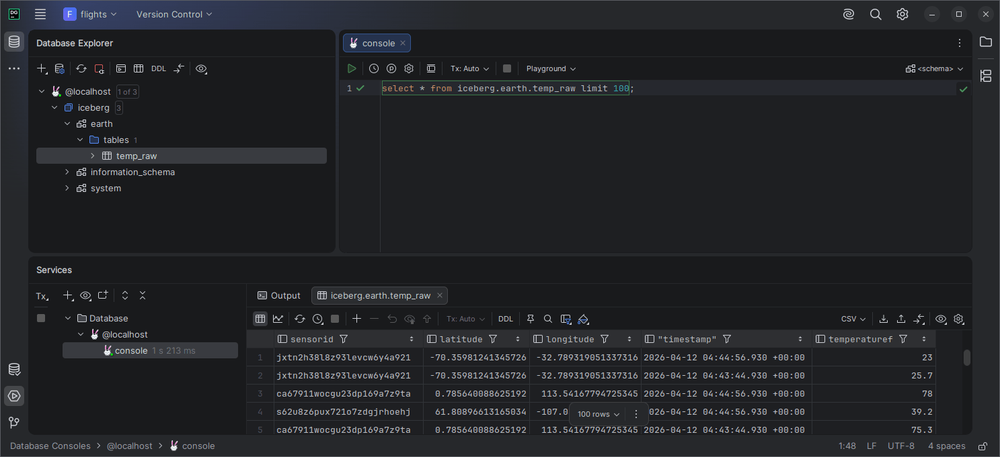
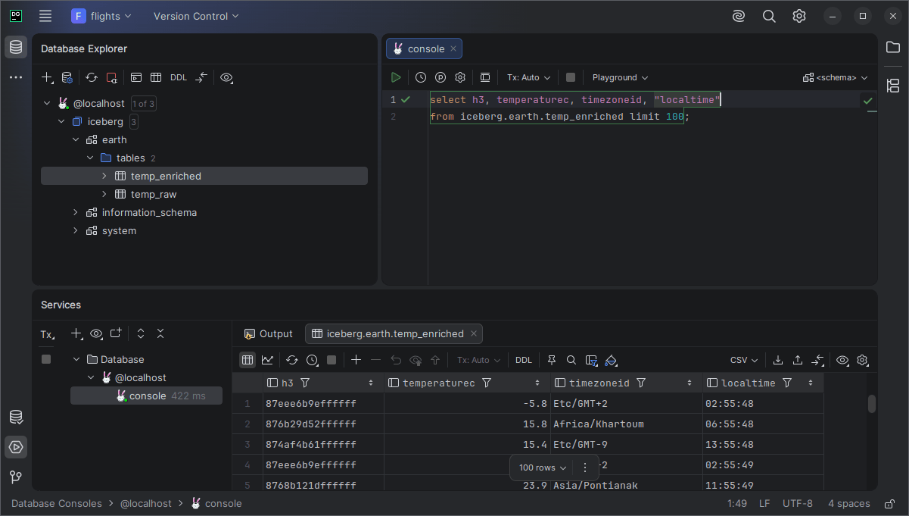

# Работа аналитика с данными через SQL

В этом разделе показан базовый сценарий работы аналитика с данными платформы через SQL.

Подключение к Trino и настройка доступа к S3/Iceberg уже описаны в разделе 03.

Аналитик работает с catalog:

```text
iceberg
```

schema:

```text
earth
```

Основные таблицы:

| Таблица | Назначение |
|---|---|
| `iceberg.earth.temp_raw` | исходные события от датчиков |
| `iceberg.earth.temp_enriched` | обогащённые события после stream-обработки |

---

## 1. Чтение raw-данных

Raw-таблица содержит исходные события от датчиков: идентификатор сенсора, координаты, время события и температуру в Fahrenheit.

Пример запроса:

```sql
SELECT *
FROM iceberg.earth.temp_raw
LIMIT 100;
```



Ожидаемый результат:

- таблица доступна для чтения;
- возвращаются строки с температурными событиями;
- есть поля `sensorid`, `latitude`, `longitude`, `timestamp`, `temperaturef`.

---

## 2. Чтение enriched-данных

Enriched-таблица содержит результат stream-обработки. В неё добавляются вычисленные и дополнительные поля, например температура в Celsius, timezone и локальное время.

Пример запроса:

```sql
SELECT h3, temperaturec, timezoneid, "localtime"
FROM iceberg.earth.temp_enriched
LIMIT 100;
```



Ожидаемый результат:

- таблица доступна для чтения;
- возвращаются обогащённые данные;
- есть поля `h3`, `temperaturec`, `timezoneid`, `localtime`.

---

## 3. Ограничения доступа

Аналитический доступ должен быть read-only.

Аналитику достаточно прав на выполнение `SELECT`-запросов. Ему не нужны:

- права записи в S3;
- доступ к Kafka Connect REST API;
- доступ к Kafbat UI;
- права на изменение Iceberg metadata/data files;
- административные credentials платформы.

Если требуется новый датасет или новая таблица, это должно оформляться как задача для команды платформы данных.